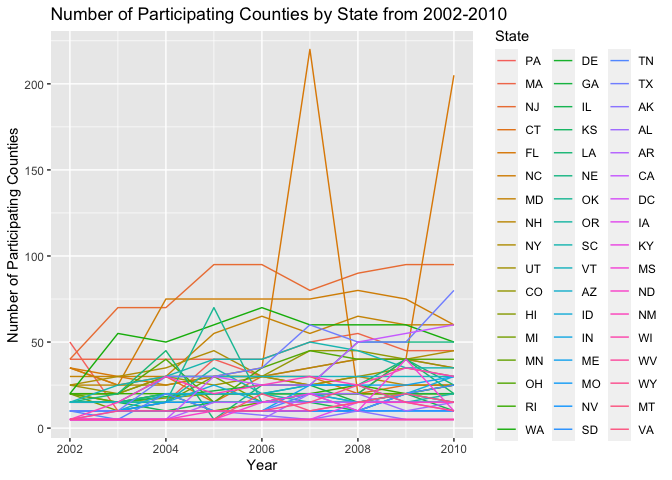
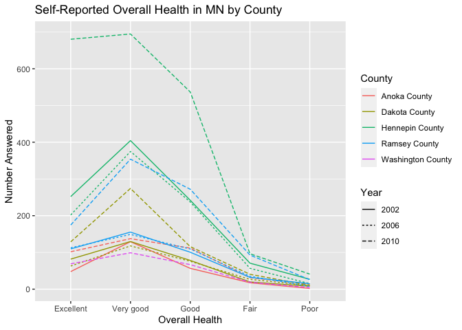

PubH 7462 HW2
================
Seth Bergstedt
2/9/2022

# Problem 3

``` r
library(tidyverse)
library(gt)
```

### 3.1

``` r
brfss = read.csv("./data/brfss_smart_2010.csv")

brfss = brfss %>% janitor::clean_names()

brfss_cleaned = brfss %>%
  mutate(county = str_replace(str_extract(brfss$locationdesc,"- .+"),"- ","")) %>%
  filter(topic %in% c("Overall Health")) %>%
  dplyr::select(year,locationabbr,county,response,sample_size,data_value) %>%
  rename("state" = locationabbr,
         "prop_response" = data_value) 
brfss_cleaned$state = as.factor(brfss_cleaned$state)
brfss_cleaned$county = as.factor(brfss_cleaned$county)
brfss_cleaned$response = as.factor(brfss_cleaned$response)
```

### 3.2

The cleaned BRFSS dataset contains 10625 observations, each of which is
a participating US county, and 6 variables which include year, state,
county name, self-reported overall health category (excellent, very
good, good, fair, or poor), number of respondents within the given
overall health category by county, and the percent of respondents
reporting the given overall health category by county. Noteable
information: there are 28\` missing observations in this dataset (each
of which comes from the proportion response variable).

### 3.3

##### 3.3.1

``` r
brfss_04 = brfss_cleaned %>%
  filter(year %in% 2004) %>%
  dplyr::select(state,county) %>%
  distinct() %>%
  group_by(state) %>%
  summarize(state_count = n())
```

In 2004, there were 8 states that were observed in exactly different 6
locations.

##### 3.3.2

``` r
brfss_plot = brfss_cleaned %>%
  filter(year %in% 2002:2010) %>%
  group_by(year,state) %>%
  distinct() %>%
  summarize(state_count = n()) %>%
  mutate(state = fct_reorder(state,state_count,mean,.desc = TRUE))
```

    ## `summarise()` has grouped output by 'year'. You can override using the `.groups` argument.

``` r
ggplot(brfss_plot) + 
  geom_line(aes(x = year,y = state_count,group = state,color = state)) + 
  labs(title = "Number of Participating Counties by State from 2002-2010",
       x = "Year",y = "Number of Participating Counties",color = "State")
```

<!-- -->

It appears that number of participating counties generally increases
over time. That said, this increase is not consistent (many states might
decrease, some state fluctuate wildly from year to year, my impression
may be the result of the fact that the states with the highest
participation increase their number of participating counties while the
rest of the states don’t change much). Altogether, the state with the
highest mean number of locations from 2002 to 2010 is Pennsylvania.
Worth noting is that the strange outlying observations come from
Florida, which has the fifth highest mean.

##### 3.3.3

``` r
brfss_mn = brfss_cleaned %>%
  filter(year %in% c(2002,2006,2010),state %in% "MN") %>%
  group_by(county,year) %>%
  mutate(num_in_county = sum(sample_size)) %>%
  pivot_wider(id_cols = c("year","county","num_in_county"),
              names_from = "response",
              values_from = "prop_response") %>%
  ungroup()

brfss_mn %>%
  mutate(across(.cols = num_in_county:Poor,
                .fns = list(mean = mean,sd = sd),
                .names = "{.col}_{.fn}")) %>%
  dplyr::select(num_in_county_mean,num_in_county_sd,
                Excellent_mean,Excellent_sd,
                "Very good_mean","Very good_sd",
                Good_mean,Good_sd,
                Fair_mean,Fair_sd,
                Poor_mean,Poor_sd) %>%
  unique() %>%
  round(digits = 3) %>%
  gt() %>%
  tab_header(title = "Means and SDs of County Numbers and Overall Health Response Proportions")
```

<div id="clpdugbcgo" style="overflow-x:auto;overflow-y:auto;width:auto;height:auto;">
<style>html {
  font-family: -apple-system, BlinkMacSystemFont, 'Segoe UI', Roboto, Oxygen, Ubuntu, Cantarell, 'Helvetica Neue', 'Fira Sans', 'Droid Sans', Arial, sans-serif;
}

#clpdugbcgo .gt_table {
  display: table;
  border-collapse: collapse;
  margin-left: auto;
  margin-right: auto;
  color: #333333;
  font-size: 16px;
  font-weight: normal;
  font-style: normal;
  background-color: #FFFFFF;
  width: auto;
  border-top-style: solid;
  border-top-width: 2px;
  border-top-color: #A8A8A8;
  border-right-style: none;
  border-right-width: 2px;
  border-right-color: #D3D3D3;
  border-bottom-style: solid;
  border-bottom-width: 2px;
  border-bottom-color: #A8A8A8;
  border-left-style: none;
  border-left-width: 2px;
  border-left-color: #D3D3D3;
}

#clpdugbcgo .gt_heading {
  background-color: #FFFFFF;
  text-align: center;
  border-bottom-color: #FFFFFF;
  border-left-style: none;
  border-left-width: 1px;
  border-left-color: #D3D3D3;
  border-right-style: none;
  border-right-width: 1px;
  border-right-color: #D3D3D3;
}

#clpdugbcgo .gt_title {
  color: #333333;
  font-size: 125%;
  font-weight: initial;
  padding-top: 4px;
  padding-bottom: 4px;
  border-bottom-color: #FFFFFF;
  border-bottom-width: 0;
}

#clpdugbcgo .gt_subtitle {
  color: #333333;
  font-size: 85%;
  font-weight: initial;
  padding-top: 0;
  padding-bottom: 6px;
  border-top-color: #FFFFFF;
  border-top-width: 0;
}

#clpdugbcgo .gt_bottom_border {
  border-bottom-style: solid;
  border-bottom-width: 2px;
  border-bottom-color: #D3D3D3;
}

#clpdugbcgo .gt_col_headings {
  border-top-style: solid;
  border-top-width: 2px;
  border-top-color: #D3D3D3;
  border-bottom-style: solid;
  border-bottom-width: 2px;
  border-bottom-color: #D3D3D3;
  border-left-style: none;
  border-left-width: 1px;
  border-left-color: #D3D3D3;
  border-right-style: none;
  border-right-width: 1px;
  border-right-color: #D3D3D3;
}

#clpdugbcgo .gt_col_heading {
  color: #333333;
  background-color: #FFFFFF;
  font-size: 100%;
  font-weight: normal;
  text-transform: inherit;
  border-left-style: none;
  border-left-width: 1px;
  border-left-color: #D3D3D3;
  border-right-style: none;
  border-right-width: 1px;
  border-right-color: #D3D3D3;
  vertical-align: bottom;
  padding-top: 5px;
  padding-bottom: 6px;
  padding-left: 5px;
  padding-right: 5px;
  overflow-x: hidden;
}

#clpdugbcgo .gt_column_spanner_outer {
  color: #333333;
  background-color: #FFFFFF;
  font-size: 100%;
  font-weight: normal;
  text-transform: inherit;
  padding-top: 0;
  padding-bottom: 0;
  padding-left: 4px;
  padding-right: 4px;
}

#clpdugbcgo .gt_column_spanner_outer:first-child {
  padding-left: 0;
}

#clpdugbcgo .gt_column_spanner_outer:last-child {
  padding-right: 0;
}

#clpdugbcgo .gt_column_spanner {
  border-bottom-style: solid;
  border-bottom-width: 2px;
  border-bottom-color: #D3D3D3;
  vertical-align: bottom;
  padding-top: 5px;
  padding-bottom: 5px;
  overflow-x: hidden;
  display: inline-block;
  width: 100%;
}

#clpdugbcgo .gt_group_heading {
  padding: 8px;
  color: #333333;
  background-color: #FFFFFF;
  font-size: 100%;
  font-weight: initial;
  text-transform: inherit;
  border-top-style: solid;
  border-top-width: 2px;
  border-top-color: #D3D3D3;
  border-bottom-style: solid;
  border-bottom-width: 2px;
  border-bottom-color: #D3D3D3;
  border-left-style: none;
  border-left-width: 1px;
  border-left-color: #D3D3D3;
  border-right-style: none;
  border-right-width: 1px;
  border-right-color: #D3D3D3;
  vertical-align: middle;
}

#clpdugbcgo .gt_empty_group_heading {
  padding: 0.5px;
  color: #333333;
  background-color: #FFFFFF;
  font-size: 100%;
  font-weight: initial;
  border-top-style: solid;
  border-top-width: 2px;
  border-top-color: #D3D3D3;
  border-bottom-style: solid;
  border-bottom-width: 2px;
  border-bottom-color: #D3D3D3;
  vertical-align: middle;
}

#clpdugbcgo .gt_from_md > :first-child {
  margin-top: 0;
}

#clpdugbcgo .gt_from_md > :last-child {
  margin-bottom: 0;
}

#clpdugbcgo .gt_row {
  padding-top: 8px;
  padding-bottom: 8px;
  padding-left: 5px;
  padding-right: 5px;
  margin: 10px;
  border-top-style: solid;
  border-top-width: 1px;
  border-top-color: #D3D3D3;
  border-left-style: none;
  border-left-width: 1px;
  border-left-color: #D3D3D3;
  border-right-style: none;
  border-right-width: 1px;
  border-right-color: #D3D3D3;
  vertical-align: middle;
  overflow-x: hidden;
}

#clpdugbcgo .gt_stub {
  color: #333333;
  background-color: #FFFFFF;
  font-size: 100%;
  font-weight: initial;
  text-transform: inherit;
  border-right-style: solid;
  border-right-width: 2px;
  border-right-color: #D3D3D3;
  padding-left: 12px;
}

#clpdugbcgo .gt_summary_row {
  color: #333333;
  background-color: #FFFFFF;
  text-transform: inherit;
  padding-top: 8px;
  padding-bottom: 8px;
  padding-left: 5px;
  padding-right: 5px;
}

#clpdugbcgo .gt_first_summary_row {
  padding-top: 8px;
  padding-bottom: 8px;
  padding-left: 5px;
  padding-right: 5px;
  border-top-style: solid;
  border-top-width: 2px;
  border-top-color: #D3D3D3;
}

#clpdugbcgo .gt_grand_summary_row {
  color: #333333;
  background-color: #FFFFFF;
  text-transform: inherit;
  padding-top: 8px;
  padding-bottom: 8px;
  padding-left: 5px;
  padding-right: 5px;
}

#clpdugbcgo .gt_first_grand_summary_row {
  padding-top: 8px;
  padding-bottom: 8px;
  padding-left: 5px;
  padding-right: 5px;
  border-top-style: double;
  border-top-width: 6px;
  border-top-color: #D3D3D3;
}

#clpdugbcgo .gt_striped {
  background-color: rgba(128, 128, 128, 0.05);
}

#clpdugbcgo .gt_table_body {
  border-top-style: solid;
  border-top-width: 2px;
  border-top-color: #D3D3D3;
  border-bottom-style: solid;
  border-bottom-width: 2px;
  border-bottom-color: #D3D3D3;
}

#clpdugbcgo .gt_footnotes {
  color: #333333;
  background-color: #FFFFFF;
  border-bottom-style: none;
  border-bottom-width: 2px;
  border-bottom-color: #D3D3D3;
  border-left-style: none;
  border-left-width: 2px;
  border-left-color: #D3D3D3;
  border-right-style: none;
  border-right-width: 2px;
  border-right-color: #D3D3D3;
}

#clpdugbcgo .gt_footnote {
  margin: 0px;
  font-size: 90%;
  padding: 4px;
}

#clpdugbcgo .gt_sourcenotes {
  color: #333333;
  background-color: #FFFFFF;
  border-bottom-style: none;
  border-bottom-width: 2px;
  border-bottom-color: #D3D3D3;
  border-left-style: none;
  border-left-width: 2px;
  border-left-color: #D3D3D3;
  border-right-style: none;
  border-right-width: 2px;
  border-right-color: #D3D3D3;
}

#clpdugbcgo .gt_sourcenote {
  font-size: 90%;
  padding: 4px;
}

#clpdugbcgo .gt_left {
  text-align: left;
}

#clpdugbcgo .gt_center {
  text-align: center;
}

#clpdugbcgo .gt_right {
  text-align: right;
  font-variant-numeric: tabular-nums;
}

#clpdugbcgo .gt_font_normal {
  font-weight: normal;
}

#clpdugbcgo .gt_font_bold {
  font-weight: bold;
}

#clpdugbcgo .gt_font_italic {
  font-style: italic;
}

#clpdugbcgo .gt_super {
  font-size: 65%;
}

#clpdugbcgo .gt_footnote_marks {
  font-style: italic;
  font-weight: normal;
  font-size: 65%;
}
</style>
<table class="gt_table">
  <thead class="gt_header">
    <tr>
      <th colspan="12" class="gt_heading gt_title gt_font_normal gt_bottom_border" style>Means and SDs of County Numbers and Overall Health Response Proportions</th>
    </tr>
    
  </thead>
  <thead class="gt_col_headings">
    <tr>
      <th class="gt_col_heading gt_columns_bottom_border gt_right" rowspan="1" colspan="1">num_in_county_mean</th>
      <th class="gt_col_heading gt_columns_bottom_border gt_right" rowspan="1" colspan="1">num_in_county_sd</th>
      <th class="gt_col_heading gt_columns_bottom_border gt_right" rowspan="1" colspan="1">Excellent_mean</th>
      <th class="gt_col_heading gt_columns_bottom_border gt_right" rowspan="1" colspan="1">Excellent_sd</th>
      <th class="gt_col_heading gt_columns_bottom_border gt_right" rowspan="1" colspan="1">Very good_mean</th>
      <th class="gt_col_heading gt_columns_bottom_border gt_right" rowspan="1" colspan="1">Very good_sd</th>
      <th class="gt_col_heading gt_columns_bottom_border gt_right" rowspan="1" colspan="1">Good_mean</th>
      <th class="gt_col_heading gt_columns_bottom_border gt_right" rowspan="1" colspan="1">Good_sd</th>
      <th class="gt_col_heading gt_columns_bottom_border gt_right" rowspan="1" colspan="1">Fair_mean</th>
      <th class="gt_col_heading gt_columns_bottom_border gt_right" rowspan="1" colspan="1">Fair_sd</th>
      <th class="gt_col_heading gt_columns_bottom_border gt_right" rowspan="1" colspan="1">Poor_mean</th>
      <th class="gt_col_heading gt_columns_bottom_border gt_right" rowspan="1" colspan="1">Poor_sd</th>
    </tr>
  </thead>
  <tbody class="gt_table_body">
    <tr><td class="gt_row gt_right">646.917</td>
<td class="gt_row gt_right">516.784</td>
<td class="gt_row gt_right">24.608</td>
<td class="gt_row gt_right">3.965</td>
<td class="gt_row gt_right">40.2</td>
<td class="gt_row gt_right">5.101</td>
<td class="gt_row gt_right">25.425</td>
<td class="gt_row gt_right">2.473</td>
<td class="gt_row gt_right">7.425</td>
<td class="gt_row gt_right">1.413</td>
<td class="gt_row gt_right">2.358</td>
<td class="gt_row gt_right">0.869</td></tr>
  </tbody>
  
  
</table>
</div>

##### 3.3.4

``` r
brfss_longer = brfss_mn %>%
  pivot_longer(cols = c("Excellent","Very good","Good","Fair","Poor"),
               names_to = "Overall_Health",
               values_to = "Proportion_Answered") %>%
  mutate(Number_Answered = num_in_county * Proportion_Answered / 100,
         county_year = str_c(county," ",year),
         Overall_Health = fct_relevel(Overall_Health,
                                      c("Excellent","Very good",
                                        "Good","Fair","Poor")))

ggplot(brfss_longer) +
  geom_line(aes(x = Overall_Health,y = Number_Answered,group = county_year,color = county,linetype = factor(year))) + 
  labs(title = "Self-Reported Overall Health in MN by County",
       x = "Overall Health",y = "Number Answered",
       color = "County",linetype = "Year")
```

<!-- -->
